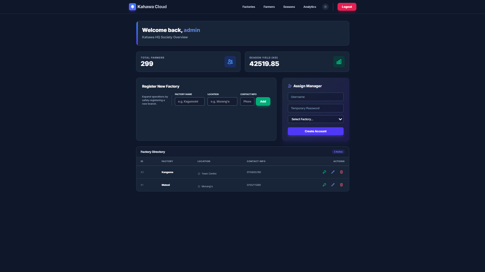
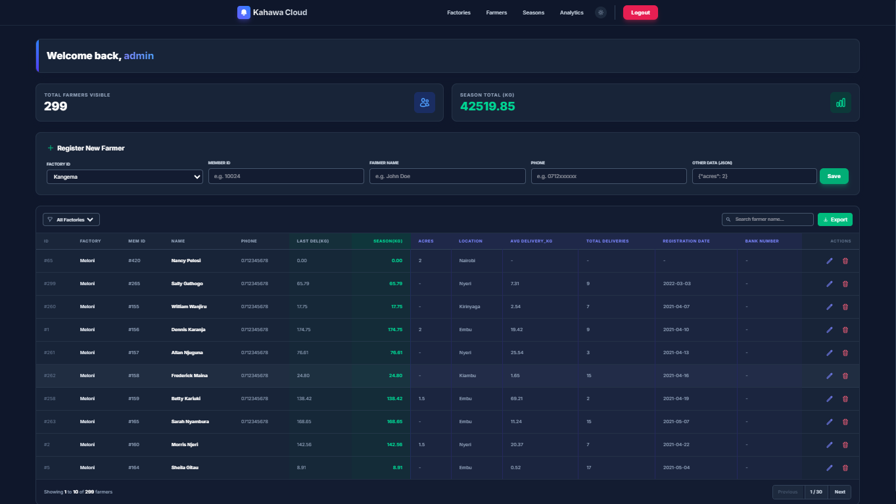
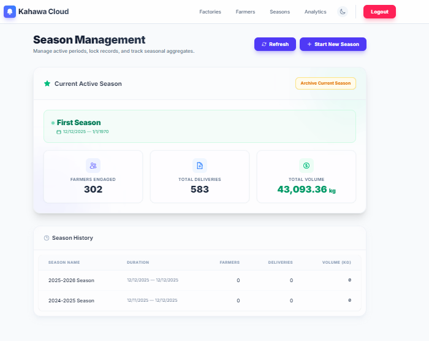
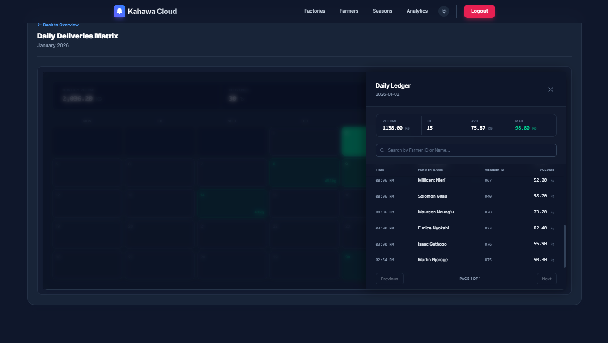
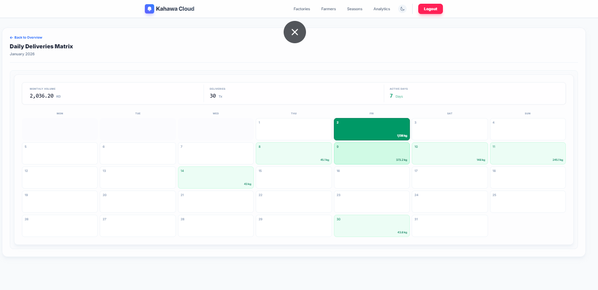
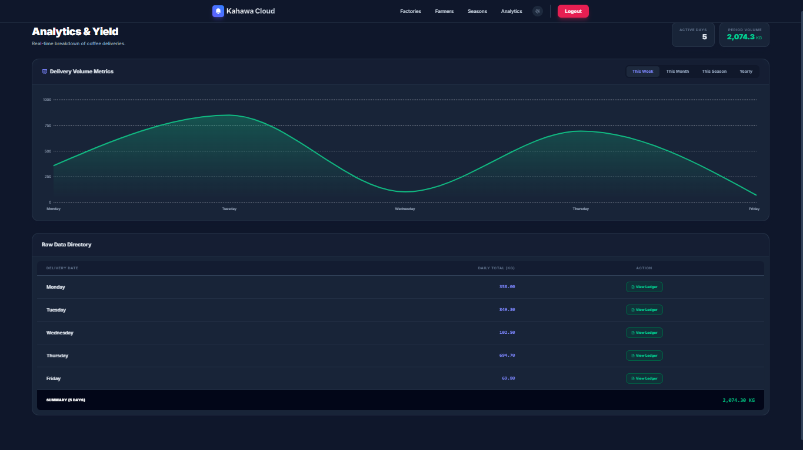
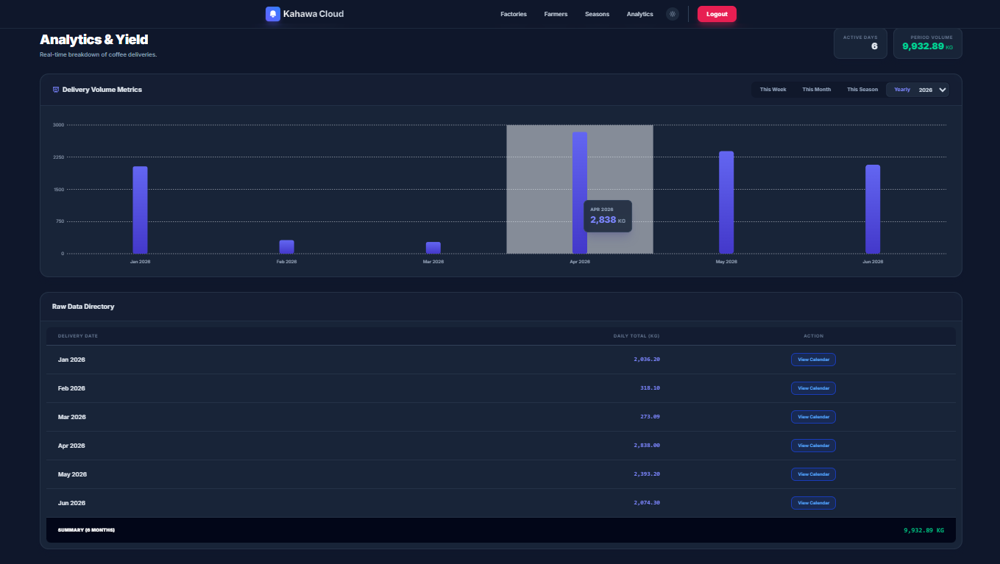
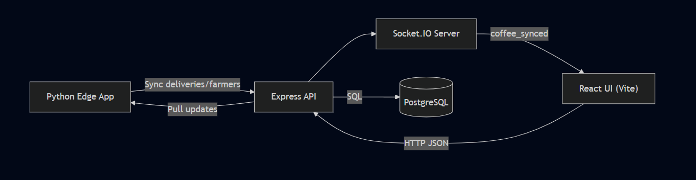
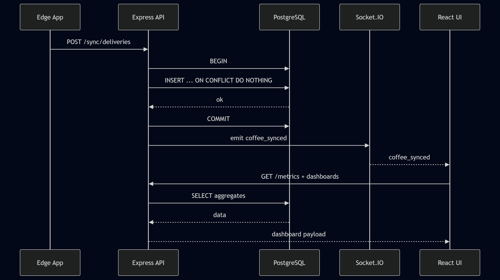
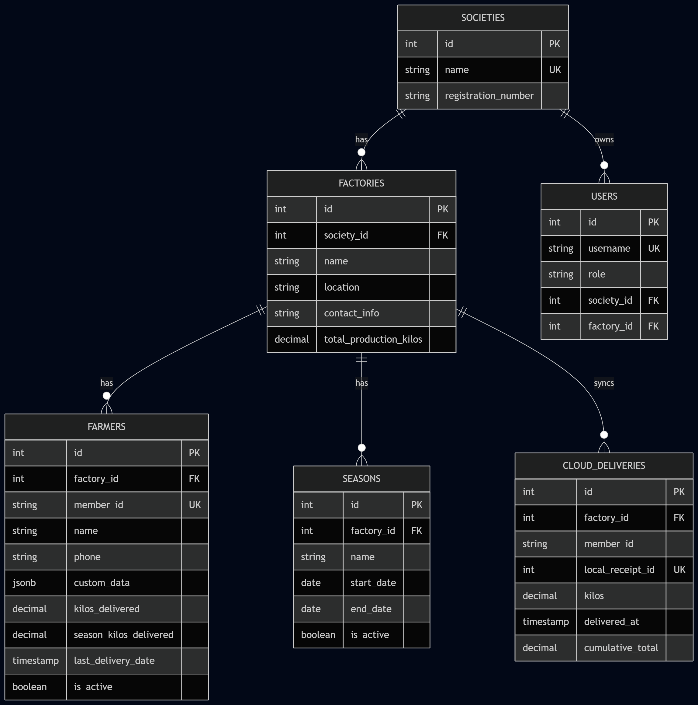

  <h1 align="center">Kahawa Cloud: Enterprise Edge-to-Cloud ERP</h1>
  

    <strong>A highly resilient, offline-first agricultural management platform engineered for rural connectivity.</strong>
  

  

    
    
    
  

---

## 🌍 The Problem
In the global agricultural sector—specifically rural coffee processing factories—internet connectivity is highly unstable. Standard web-based SaaS solutions fundamentally fail in these environments because they require a constant connection to log critical, rapid-fire transactions (like weighing daily coffee deliveries).

This forces factories to rely on paper ledgers or fragmented Excel spreadsheets, resulting in massive data silos, human error, and a complete lack of operational visibility for corporate executives.

## 🚀 The Solution: Kahawa Cloud
**Kahawa Cloud** is a proprietary, multi-tenant distributed system built to completely bridge the gap between the rural factory floor and the corporate boardroom. 

The ecosystem consists of two distinct components that operate in tandem:
1. **The Edge Desktop App (Python/SQLite):** A lightweight, offline-first application deployed directly on factory computers. Clerks can log hundreds of daily farmer deliveries completely offline with zero latency.
2. **The Centralized Cloud Dashboard (Node.js/React/PostgreSQL):** A corporate portal where executives can oversee operations. When the rural factory detects an internet connection, it silently and securely synchronizes its local ledger to the cloud in the background.

---

## ✨ Key Features & Business Value

### 📡 Indempotent Edge-to-Cloud Sync
Network retries, internet flickering, and dropped packets are natively handled. The system utilizes unique cryptographic edge receipt tracking and Postgres `ON CONFLICT` algorithms to guarantee **zero data duplication** in the cloud, no matter how terrible the connection is.

### ⚡ Real-Time WebSocket Telemetry
The exact millisecond a batch of offline transactions successfully reaches the cloud database, the Express backend fires a `Socket.IO` broadcast. The React dashboards in the boardroom instantly update their charts and totals without the executives ever having to click "refresh".

### 🔒 Enterprise Role-Based Access Control (RBAC)
Strict Multi-Tenancy architecture enforced by JSON Web Tokens (JWT).
- **Chairman View:** Aggregated oversight of all factories and thousands of farmers within their society.
- **Factory Manager View:** Cryptographically restricted namespace showing only their specific local factory operations.

### 🧠 Zero-Latency Derived State
To provide a premium SaaS experience, the dashboard avoids crushing the server with database polling. Dashboard filtering and metric calculations are processed locally in the user's browser via algorithmic `.filter()` and `.reduce()` memory transformations, resulting in instantaneous UI updates.

---

## 🛠️ Technology Stack

| Component | Technology | Purpose |
| :--- | :--- | :--- |
| **Frontend UI** | React 19, Vite, Tailwind CSS, Recharts | High-performance, reactive data visualization |
| **Backend API** | Node.js, Express.js, Socket.IO | Asynchronous routing and WebSocket broadcasting |
| **Database** | PostgreSQL 15 (Neon DB), PL/pgSQL | ACID-compliant event sourcing and live trigger aggregation |
| **Edge App** | Python, Tkinter, SQLite, Requests | Offline persistence and payload transmission |
| **Infrastructure**| Docker, Render, Vercel | Containerized local development and Serverless deployment |

---

## 📸 Application Interface

*(Note: The following screenshots showcase the live React UI, powered by real-time WebSockets and zero-latency derived state calculations.)*

### Multi-Tenant Overview (Factories)

### Farmers Management

### Seasons Management

### Real-Time Daily Ledger

### Analytics: Monthly Yields

### Analytics: Weekly Activity

### Analytics: Seasonal Trends

---

## 🏗️ System Architecture

*(Note: The source code is maintained in a private repository. The diagrams below illustrate the system's structural flow.)*

### 1. Macro Architecture & Data Flow
The platform operates on an Active-Active data model where both the Edge and the Cloud can mutate data independently.

### 2. Synchronization Conflict Resolution
To handle concurrent edits (e.g., a Chairman editing a farmer's profile in the cloud while a clerk edits it offline at the edge), the system executes a **"Last Write Wins" Pull-Before-Push** protocol governed directly by the PostgreSQL engine.

### 3. Database Entity Relationship Model
Designed for dynamic flexibility, the `farmers` table utilizes PostgreSQL `JSONB` columns to allow different factories to track custom agricultural metrics (e.g., acreage vs. fertilizer usage) without requiring schema migrations.

---

## 🛣️ Future Roadmap
- [ ] **SMS Integration:** Automatically ping farmers via Twilio API when their delivery is successfully synced to the cloud.
- [ ] **Mobile Payment System:** Integrate with local mobile money APIs (like M-Pesa) to automate direct financial disbursements based on delivery yields.
- [ ] **Immutable Audit Logs:** Implement a blockchain-style append-only ledger for all CRUD operations to ensure forensic-level financial compliance.
- [ ] **Machine Learning Yield Prediction:** Analyze historical weather data against delivery weights to predict seasonal factory output.
- [ ] **Hardware Integration:** Connect the Edge Desktop App directly to serial-port digital scales to automate weight capture and eliminate manual entry errors.

---

> **Note to Visitors & Investors:**
> The source code for the Kahawa Cloud ecosystem is proprietary and currently closed-source as the product prepares for commercial distribution. If you are interested in a live demonstration of the software, please reach out directly!
